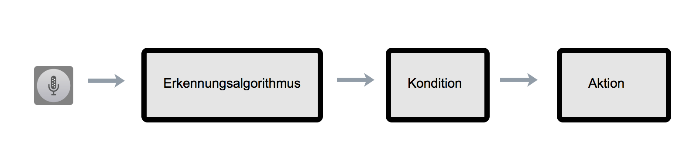
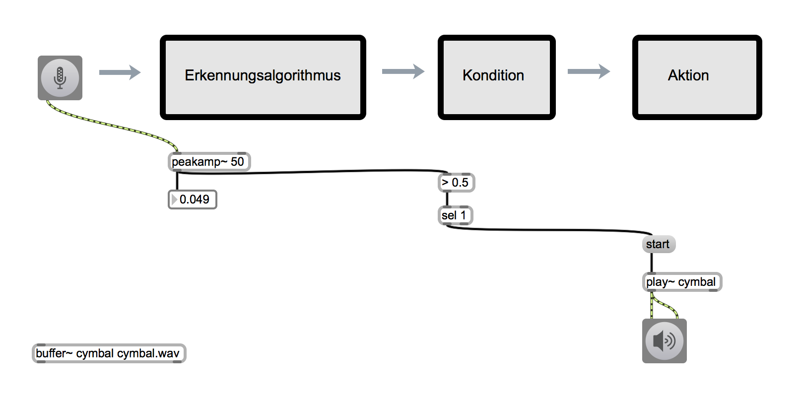
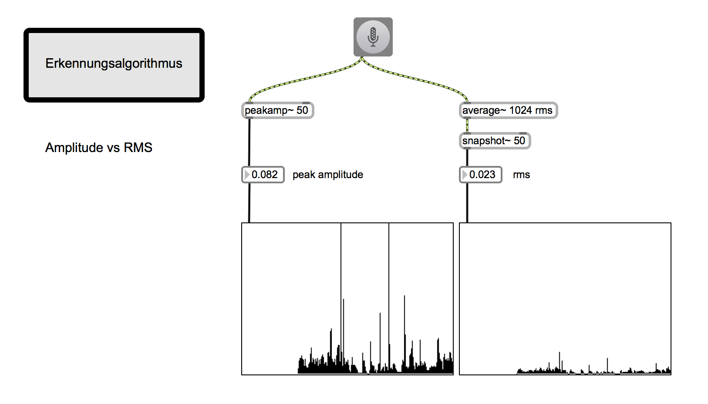
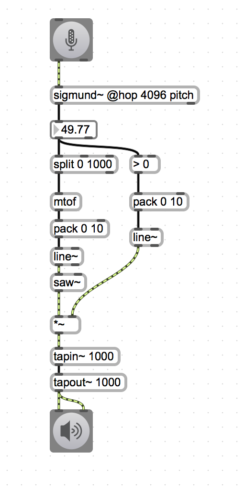
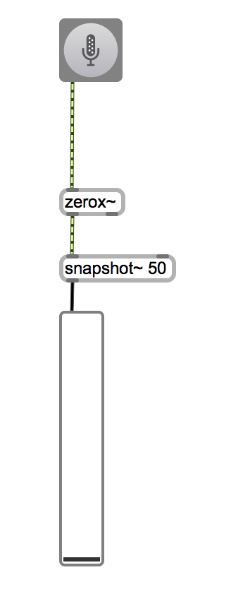
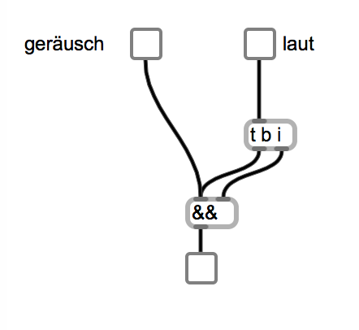
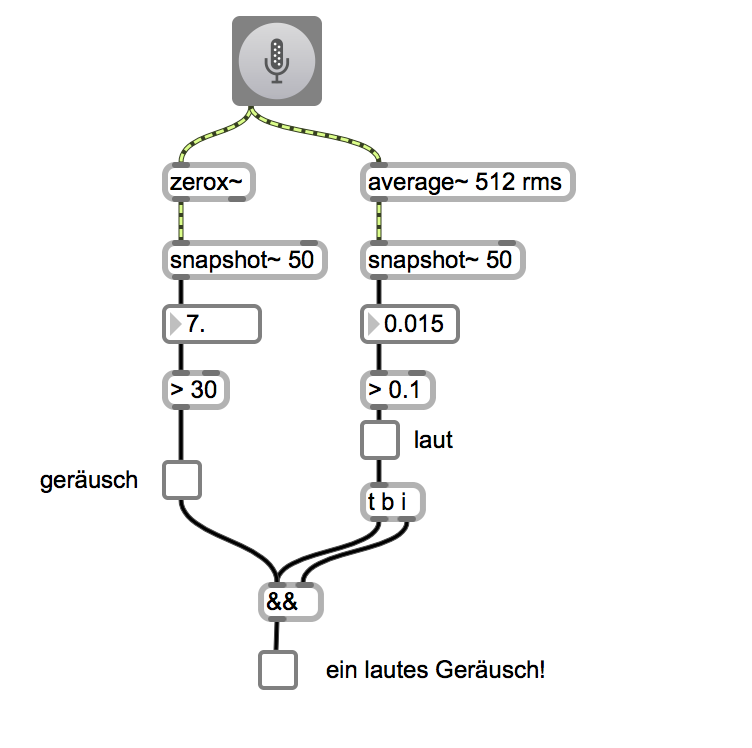
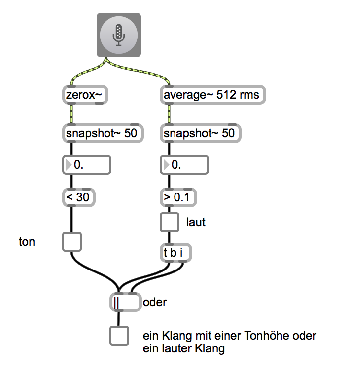
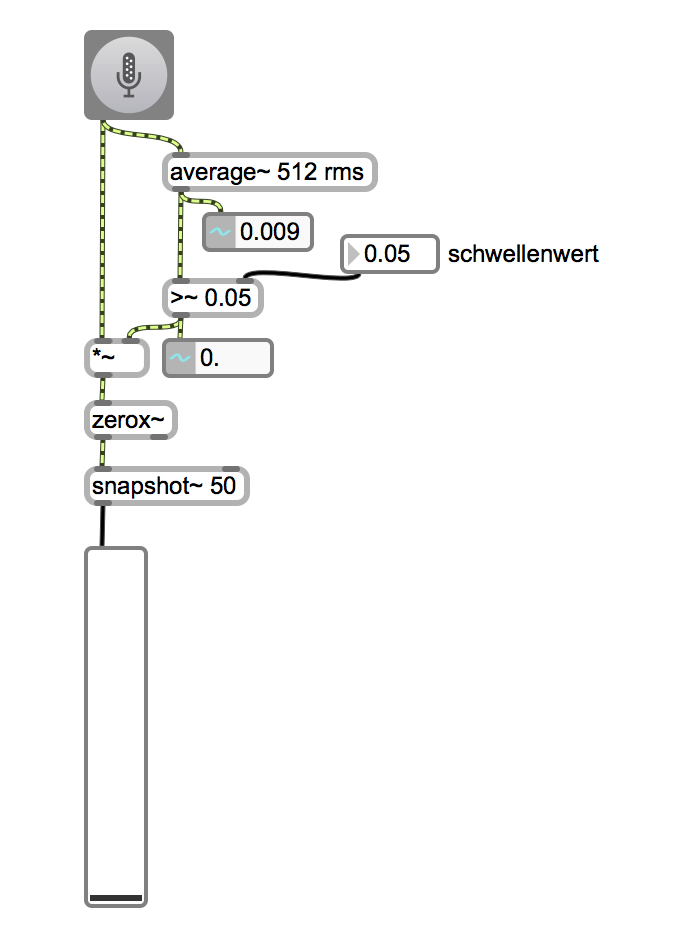

#Klasse1 - Reaktion

## patch1: Konzept
 
 
## patch2: Beispiel
 

## patch3: Amplitude vs RMS
 

## patch 4: Frequenzerkennung 
[Sigmund von Miller S Puckette](http://vboehm.net/2015/06/a-64-bit-version-of-sigmund/)

### Miller Puckette Externals

## patch 5: Geräuschhaftigkeitserkennung
 

## patch 6: Mehrere Konditionen 
 z.B. ein System, das auf ein lauten Geräusch reagiert.
 
### logical AND 

### Umsetzung mit zerox~ und average~

### logical OR

## patch 7: Preprocessing

Die Entfernung des unnötiges Signals vor der Analyze.

### Gating
wenn die Amplitude nicht hoch ist, mach das Tor zu.

 
### Filter

zu Tiefe Frequenz und zu höhe Frequenz brauchen wir nicht für die Analyze.

## HA
programmieren Sie ein reaktionsystem, die mind. zwei Aspekte des eingegebenen Klangs analyziert und darauf reagiert. 
