#Klasse2 - Techniken für Erkennung

## Objekte

- snapshot~
- average~ 
- zerox~ 
- peekamp~ 
- &&
- ||
- sigmund~

### Weitere Logical Operators

- !
- ==
- !=
- >
- >=
- <
- <=

## patch 1: Anti-Chatter

### Trade-off von Average-Interval
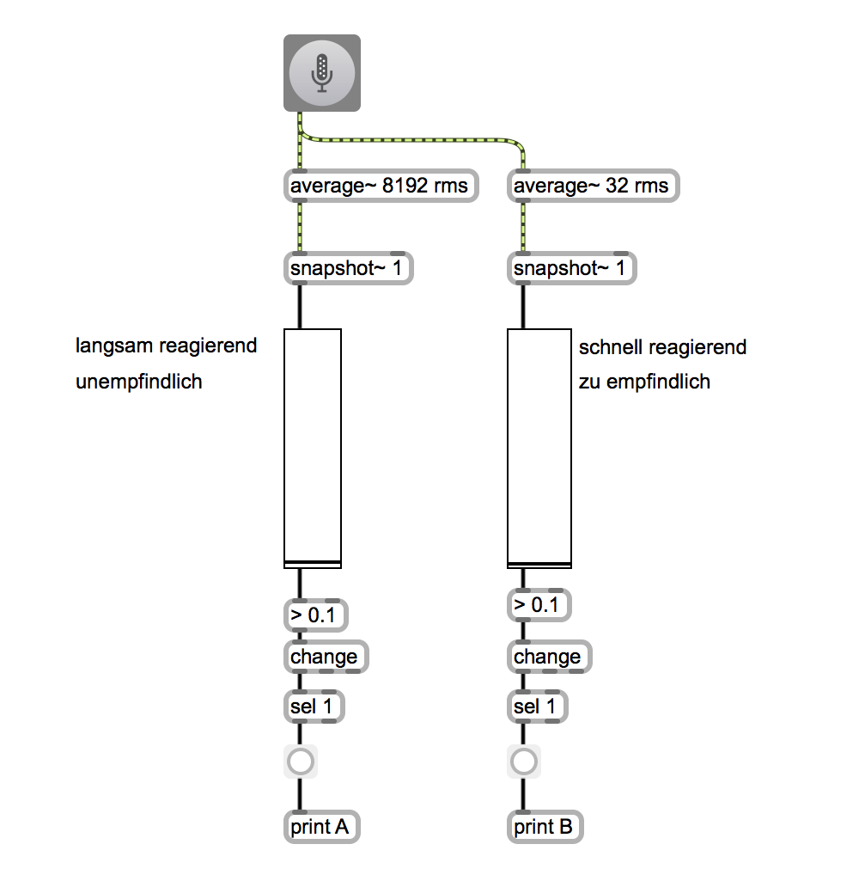

### Anti-Chatter
 

## patch 2: Zählung der Töne
 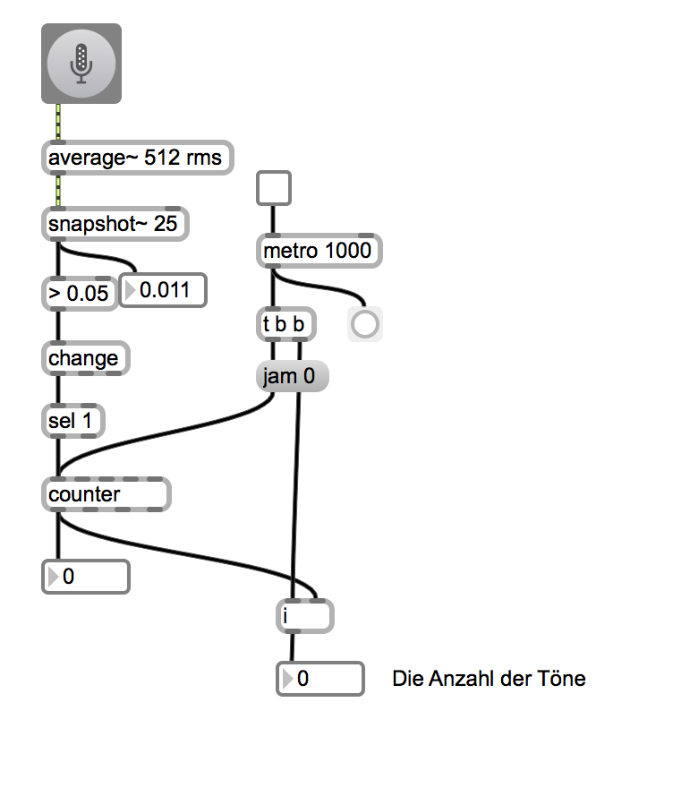
 

## patch 3: Delta
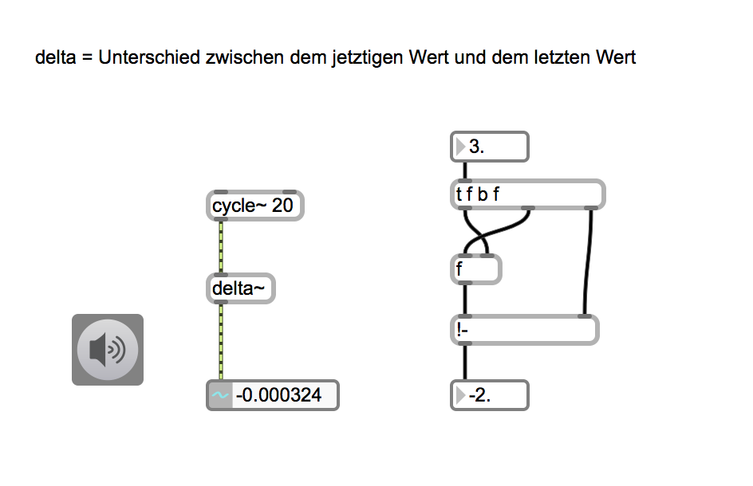

## patch 4: Anwendung eines Delta-Werts

### Transient-Erkennung
 

## patch 5: Dauer eines Tons

### thresh~
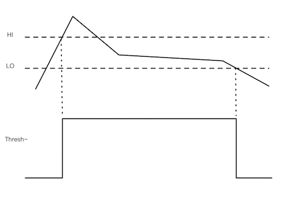

### thresh~ + edge~
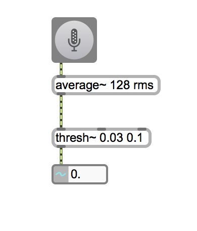

### thresh~ + edge~ + timer
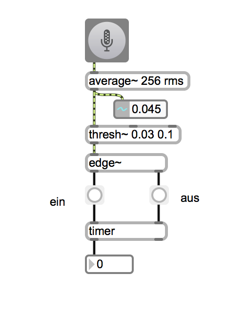

## patch 6: Aufnahme einer Hüllkurve
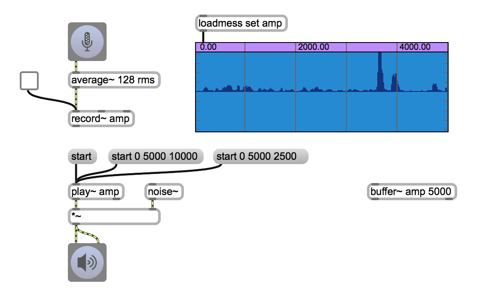

## patch 7: Rhythmuserkennung
### LCD
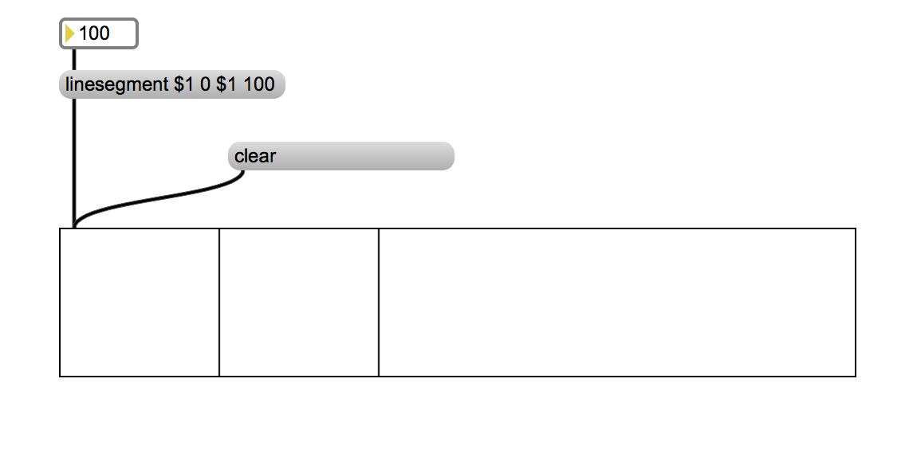 

### Visualisierung des Analyzeergebnises
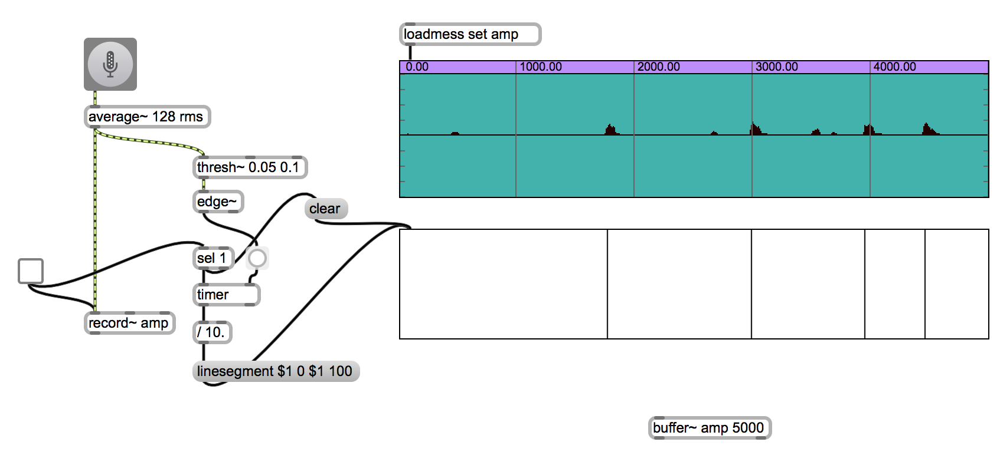 

## patch 8: Datensammlung mit coll

### coll
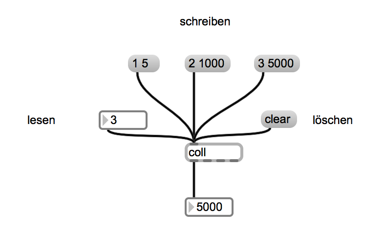

### Kombination mit der Rhythmuserkennung
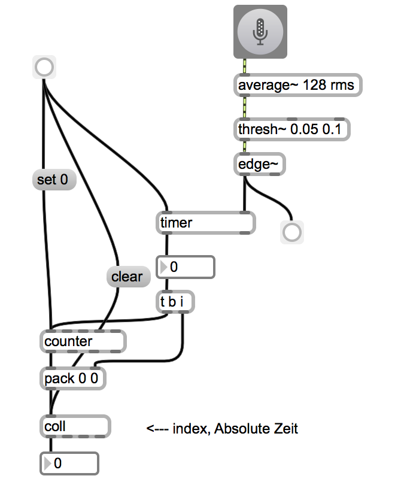

## patch 9: Imitation eines Rhythms (Drum Trigger)
### Samlung der Deltazeiten
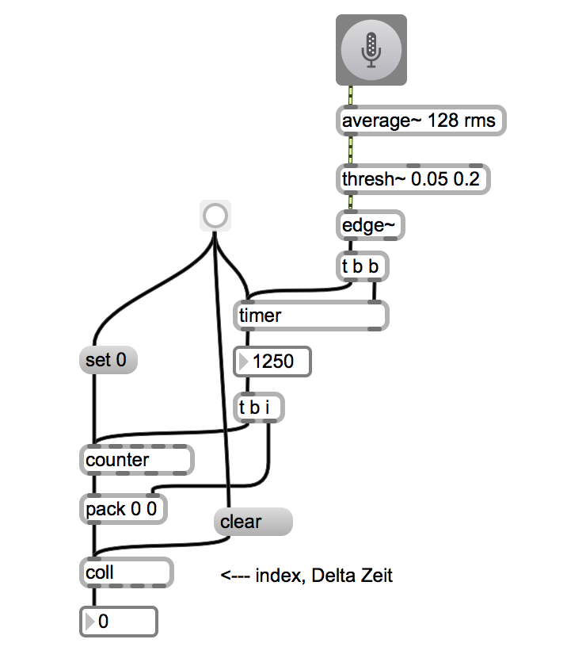

### Drum triggering
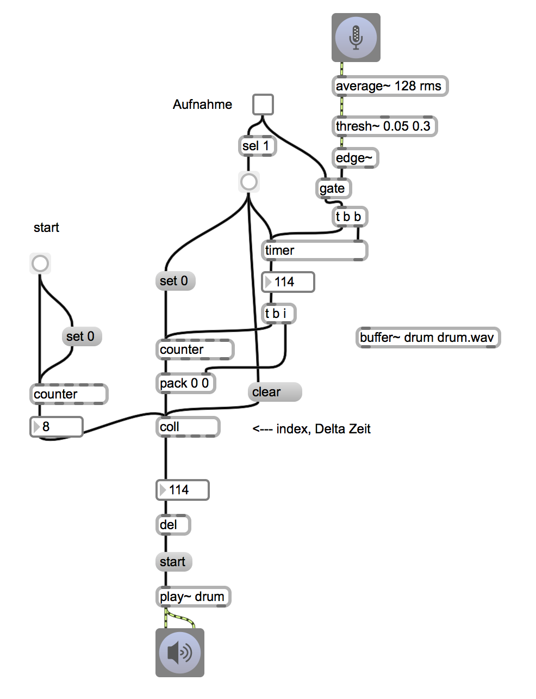

## HA
programmieren Sie ein reaktionsystem, das obenstehende Erkennungstechniken sinvoll verwendet.
