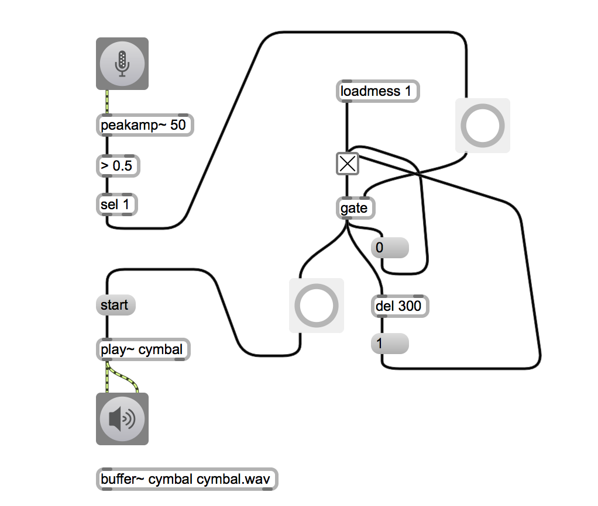
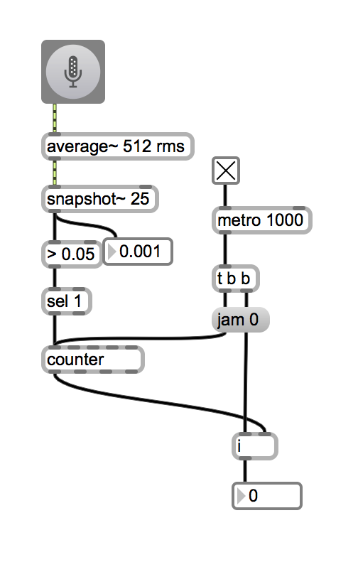

#Klasse3 - Mapping

## Objekte

- snapshot~
- average~ 
- zerox~ 
- peekamp~ 
- &&
- ||
- sigmund~

## patch 1: Anti-Chatter
 

## patch 2: Statistik 1
 
 
 
## patch 3: Statistik 2
 

## patch 4: Delta

## patch 5: Dynamismus (Delta + Statistik)

## patch 6: Hüllkurve

## patch 7: Onset-Erkennung 1

## patch 8: Onset-Erkennung 2

## patch 9: Klangfarbeanalyze 1

## patch 10: Klangfarbeanalyze 2

## patch 11: Klangfarbeanalyze 3

## HA
programmieren Sie ein reaktionsystem, die mind. zwei Aspekte des eingegebenen Klangs analyziert und darauf reagiert. 
