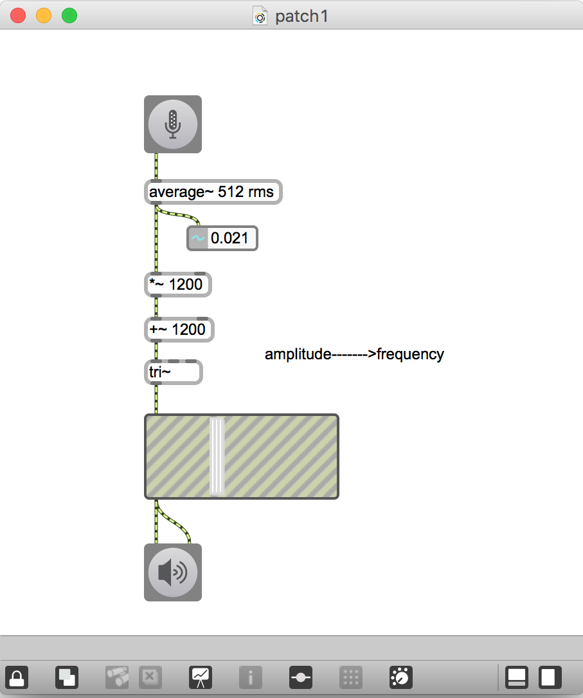
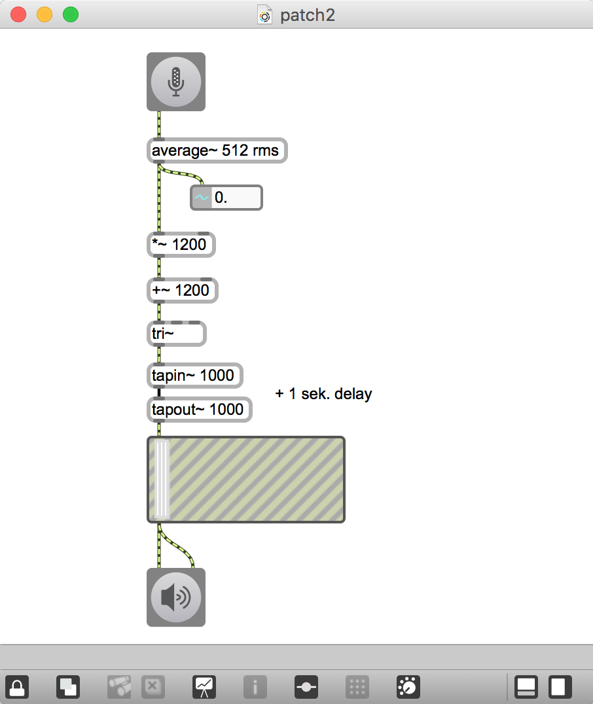
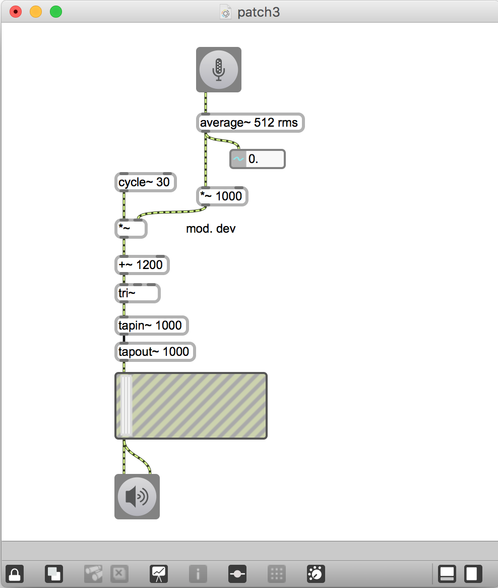
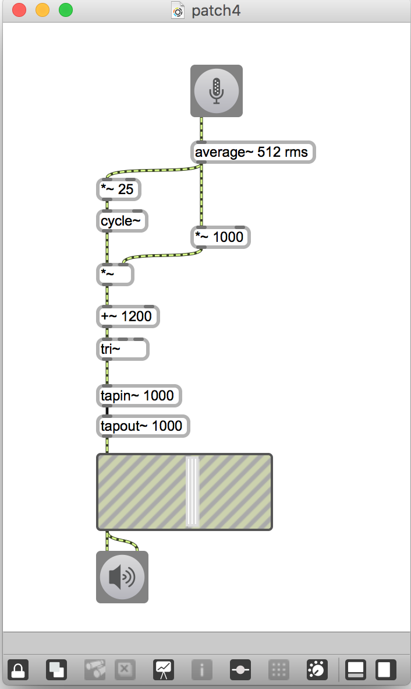
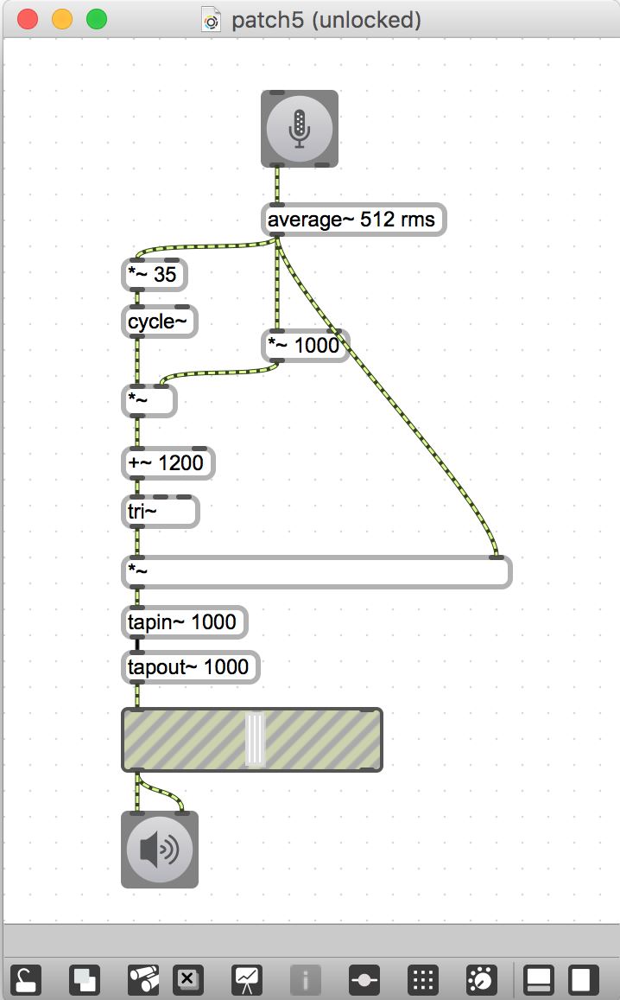
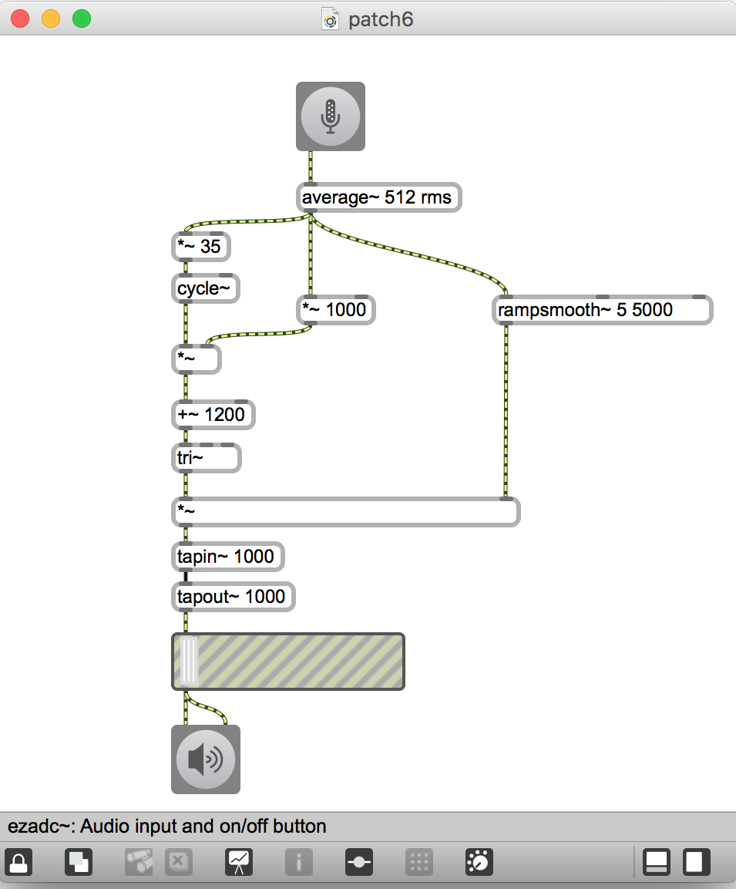
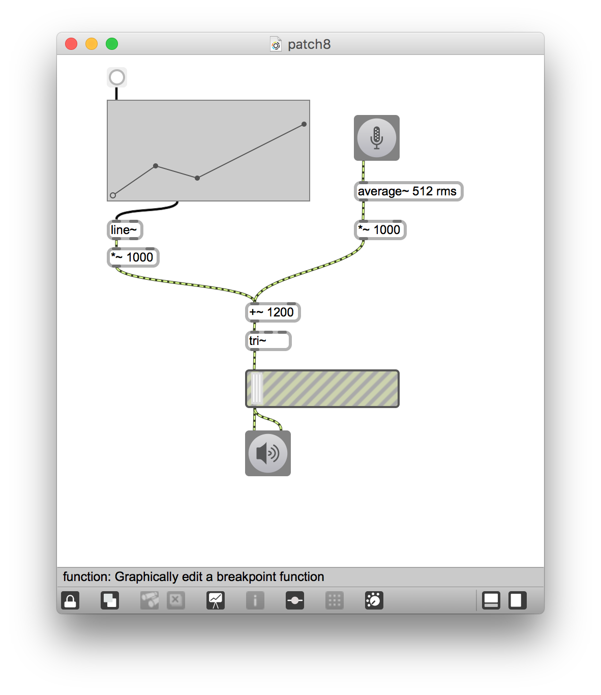
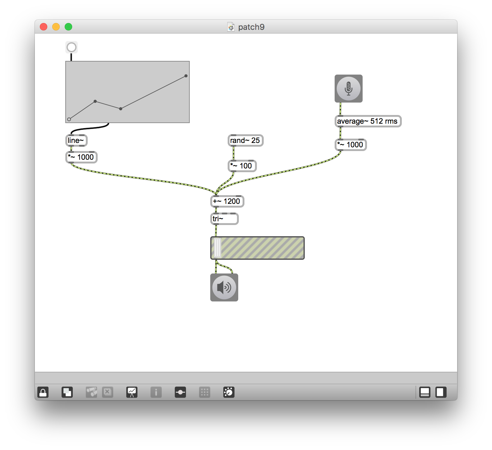

#Klasse4 - Mapping mit Synth

## patch 1 : one to one mapping (amplitude steuert frequenz)

## patch 2 : one to one mapping (mit delay)

 
## patch 3 : one to one mapping (FM)

## patch 4 : one to many mapping (Mod Freq + Mod Dev)

## patch 5 : one to many mapping (Mod Freq + Mod Dev + Amp)

## patch 6 : rampsmooth 

## patch 7 : delayed parameter mapping

## patch 8 : many to one mapping #1

## patch 9 : many to one mapping #2

