#Klasse5 - Klangerkennung mit FFT

## patch1 : FFT Ergebnis in einem Buffer

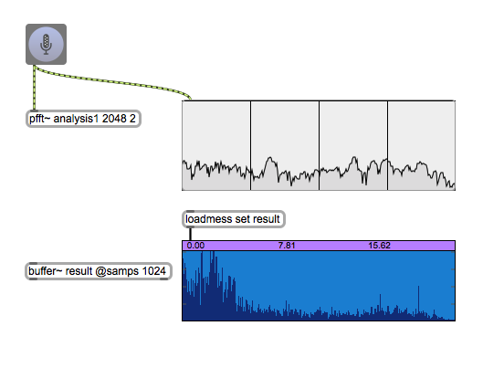
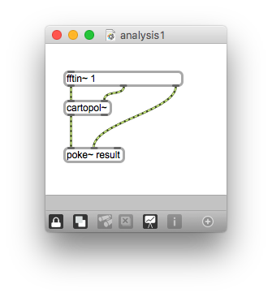

## patch2 : Summe der Magnituden

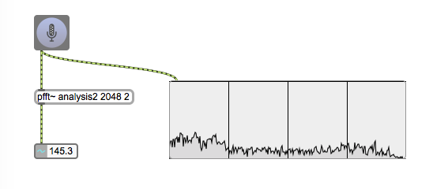
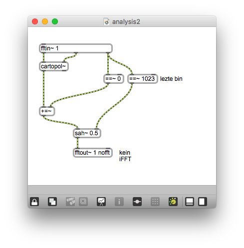

## patch3 : FFT Abschnitt

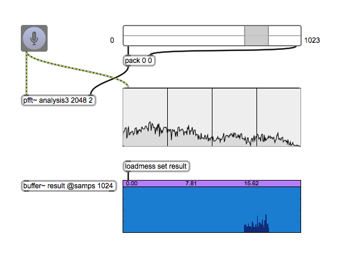
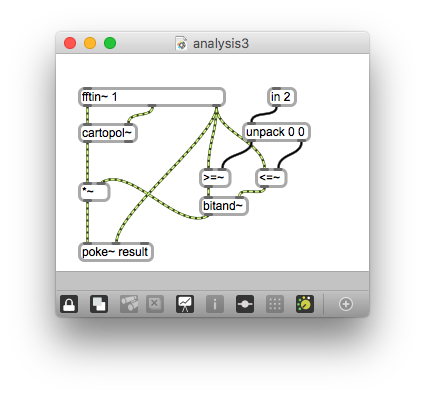

## patch4 : Summe der Magnituden eines Abschnittes

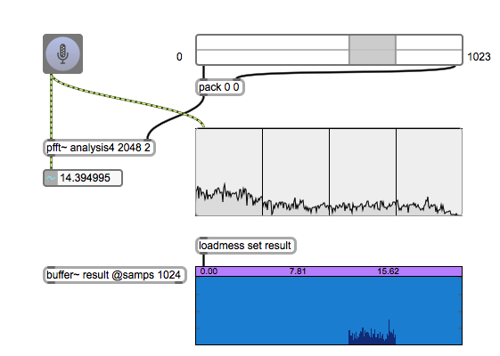
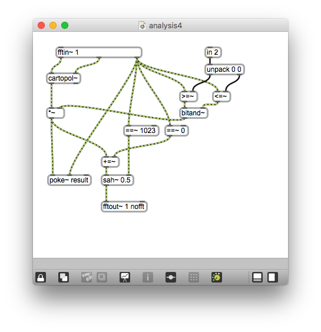

## patch5 : Centroid

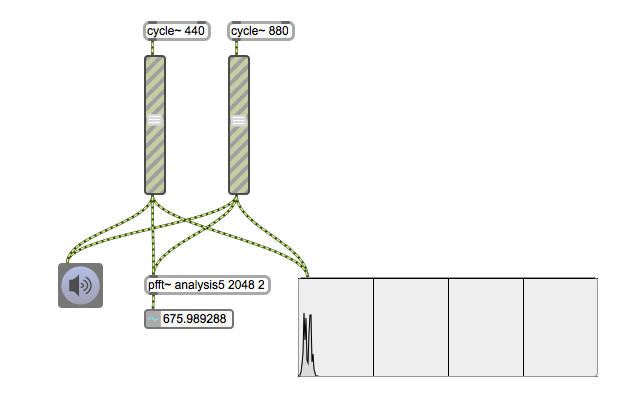
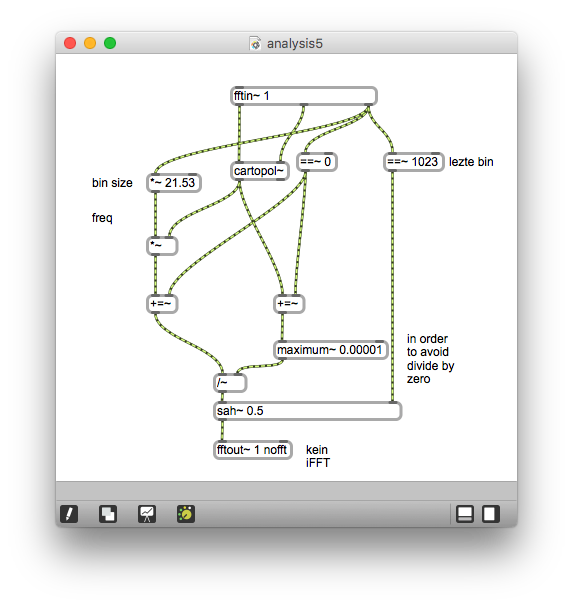

## patch6 : Spektrale Delta

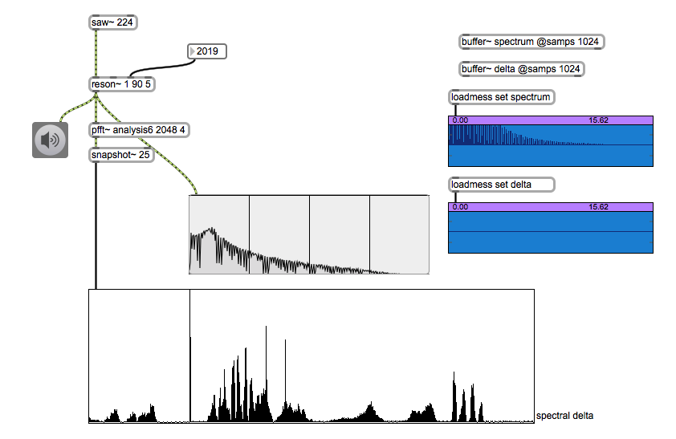
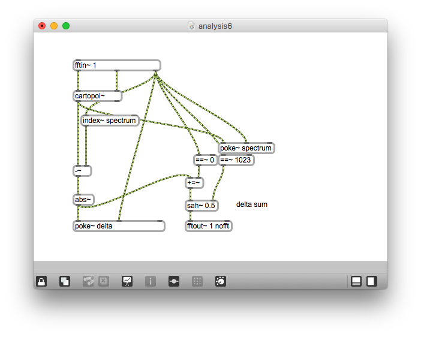

